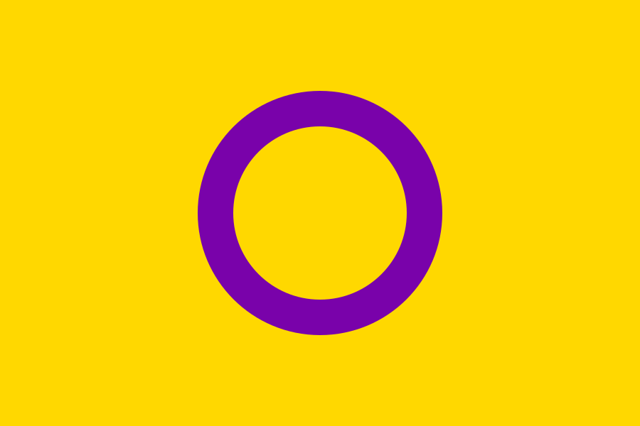

- [骄傲旗帜](#骄傲旗帜)
  - [无性恋骄傲旗帜](#无性恋骄傲旗帜)
  - [双性恋骄傲旗帜](#双性恋骄傲旗帜)
  - [彩虹旗](#彩虹旗)
  - [性别酷儿骄傲旗帜](#性别酷儿骄傲旗帜)
  - [双性人骄傲旗帜](#双性人骄傲旗帜)
  - [女同性恋骄傲旗帜](#女同性恋骄傲旗帜)
  - [泛性恋骄傲旗帜](#泛性恋骄傲旗帜)
  - [跨性别骄傲旗帜](#跨性别骄傲旗帜)
# 骄傲旗帜
>根据首拼排序,不包含其他意义
## 无性恋骄傲旗帜
 
***
## 双性恋骄傲旗帜
 
## 彩虹旗
 
## 性别酷儿骄傲旗帜
 
## 双性人骄傲旗帜
 
## 女同性恋骄傲旗帜
 
## 泛性恋骄傲旗帜
 
## 跨性别骄傲旗帜
 